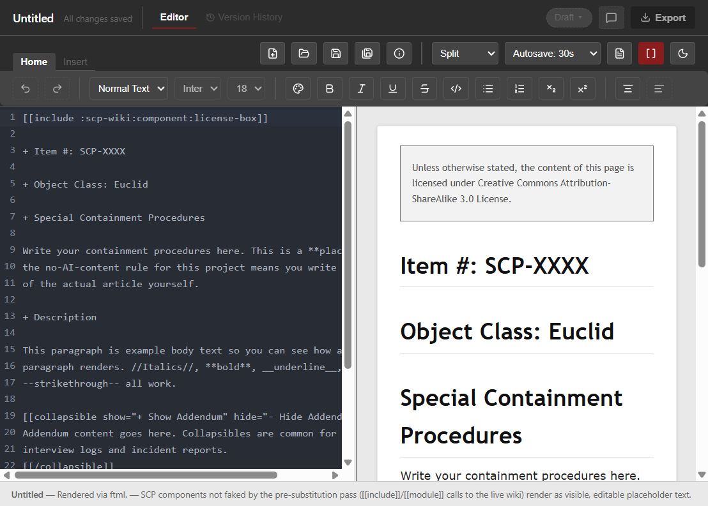

# SCP Doc Editor

A desktop editor for writing SCP Wikidot articles, with a live preview
rendered by the SCP Wiki's own **ftml** parser (compiled to wasm) instead
of a homegrown regex approximation so what you see is what will actually
(more or less, still in beta so I'm constantly looking to improve it) render on the wiki.



## Features

- **Real Wikidot rendering** — the preview pane uses [ftml](https://github.com/scpwiki/ftml), the actual
  parser scp-wiki.wikidot.com runs.
- **Two ways to write** — a raw Wikidot source editor (with syntax
  helpers like auto-closing brackets) side-by-side with the preview, or a
  block-based Rich Text mode (WYSIWYG) for composing without touching markup
  directly.
- **Autosave** — backs up unsaved changes on a user-configurable
  interval.
- **Recent files & file associations** — `.wikidot` files open
  directly from Explorer/Finder, and the app remembers what you were
  last working on.

## Download

Pre-built installers are published on the
[Releases page](https://github.com/Prabean1/scp-editor/releases).
Grab the one for your platform:

| Platform | File | Notes |
|---|---|---|
| Windows | `scp-doc-editor-<version>-setup.exe` | Installer (NSIS). Unsigned — see below. |
| macOS | `scp-doc-editor-<version>.dmg` | Unsigned/not notarized — see below. |
| Linux | `scp-doc-editor-<version>.AppImage`, `.deb`, or `.snap` | Pick whichever fits your distro. |

**About the "unrecognized publisher" warnings:** this project doesn't
(yet) pay for a code-signing certificate, so your OS will flag the
installer as coming from an unverified source. You're
welcome to build from source yourself instead if you'd rather not click
through the warning:

- **Windows:** SmartScreen will say "Windows protected your PC" — click
  **More info → Run anyway**.
- **macOS:** Gatekeeper will refuse to open it from a normal double-click
  — right-click (or Control-click) the app and choose **Open**, then
  confirm in the dialog that appears.
- **Linux (AppImage):** mark it executable first —
  `chmod +x scp-doc-editor-*.AppImage`.

## Building from source

Requires [Node.js](https://nodejs.org/) (v20+ recommended).

```bash
git clone https://github.com/Prabean1/scp-editor.git
cd scp-editor
npm install
```

### Development

```bash
npm run dev
```

### Package an installer

```bash
npm run build:win    # Windows
npm run build:mac    # macOS
npm run build:linux  # Linux
```

Output lands in `dist/`.

## License

AGPL-3.0-or-later (see `LICENSE`). This app statically bundles and calls
into [ftml](https://github.com/scpwiki/ftml) (compiled to wasm, running
in-process in Electron's main process), which is itself
AGPL-3.0-or-later/
